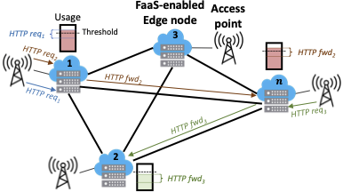

# DFaaS: Decentralized Function-as-a-Service for Federated Edge 
This repository holds DFaaS, a novel decentralized FaaS-based architecture designed to automatically and autonomously balance the traffic load across edge nodes belonging to federated Edge Computing ecosystems.

DFaaS implementation relies on an overlay peer-to-peer network and a distributed control algorithm that takes decisions on load redistribution. Although preliminary, our results confirm the feasibility of the approach, showing that the system can transparently redistribute the load across edge nodes when they become overloaded.

Our prototype is based on OpenFaaS and implements the control logic within Go P2P agents.

This research work is conducted by the INteraction and SemantIcs for Innovation with Data & Services (INSID&S) Laboratory of the University of Milano - Bicocca.

If you wish to reuse this source code, please consider citing our article describing the first prototype:

> Michele Ciavotta, Davide Motterlini, Marco Savi, Alessandro Tundo <br>
> [**DFaaS: Decentralized Function-as-a-Service for Federated Edge Computing**](https://doi.org/10.1109/CloudNet53349.2021.9657141), <br>	
> 2021 IEEE 10th International Conference on Cloud Networking (CloudNet), DOI: 10.1109/CloudNet53349.2021.9657141.

## Scenario



The above figure depicts the considered network scenario. A set of geographically-distributed _FaaS-enabled edge nodes_ (or simply _edge nodes_) is deployed at the edge of the access network. 

Each of these nodes deploys a _DFaaS platform_ for the execution of _serverless functions_, and is connected to a wireless or wired _access point_ (e.g. a base station, a broadband network gateway, a WiFi access point, etc.).

The edge node can receive functions' execution _requests_, in the form of HTTP requests, generated by the _users_ served by the access point.

## Architecture


## Prototype
This prototype relies on [HAProxy](https://www.haproxy.org/) to implement the proxy component,
and on [faasd](https://github.com/openfaas/faasd) (a lightweight version of OpenFaaS) to implement the FaaS platform.

Also, we exploit [Sysbox](https://github.com/nestybox/sysbox), an open-source and free container runtime
(a specialized "runc") that enhances containers in two key ways:

- improves container isolation
- enables containers to run same workloads as VMs

Thanks to Sysbox we are able to run our prototype as a standalone Docker container that executes our agent,
the HAProxy and faasd all together.
This way, we can run several emulated edge nodes by simply executing multiple Docker containers.

### Requirements

#### Docker CE
You can follow the [official user guide](https://docs.docker.com/engine/install/).

#### Sysbox CE

You can follow the [official user guide](https://github.com/nestybox/sysbox/blob/master/docs/user-guide/install-package.md).

> We do not recommend to set up `sysbox-runc` as your default container, you can skip that part of the guide.
> 
> We instead recommend installing [shiftfs](https://github.com/nestybox/sysbox/blob/master/docs/user-guide/install-package.md#installing-shiftfs)
> according to your kernel version as suggested by the Sysbox CE user guide.

### Build Docker images

```shell
# Paths assume you are executing from the project root directory
docker build -t dfaas-agent-builder:latest -f docker/dfaas-agent-builder.dockerfile dfaasagent
docker build -t dfaas-node:latest -f docker/dfaas-node.dockerfile docker
```

### Run a node
```shell
# We bind the default proxy port (80) to the host port 8080 
docker run --rm --name dfaas-node --runtime=sysbox-runc --publish 8080:80 --env AGENT_IPV4=127.0.0.01 dfaas-node:latest
```

### Deploy a function in a node
```shell
# Enter into the dfaas-node container
docker exec -it dfaas-node bash
# This script waits for the OpenFaaS gateway to be up (max 20 retries, 10s delay) then deploys 4 functions from the OpenFaas store.
# See docker/files/faasd/deploy_functions.sh for further details.
./deploy_functions.sh
exit
```

### Invoke a function
```shell
curl http://localhost:8080/function/figlet -d 'Hello DFaaS world!'
```

## Emulator
For a complex setup running several emulated edge nodes with different topologies see [emulator directory](emulator).
We provide instructions and examples to execute DFaaS nodes via [Containernet emulator](https://containernet.github.io/).

## Simulator

We also provide a simulator to test and compare different load balancing techniques.
The simulation code is available into the [simulation directory](simulation).
Data gathered by the DFaaS system used for simulation are available [here](data).

For more information read associated [README](simulation/README.md) file.
