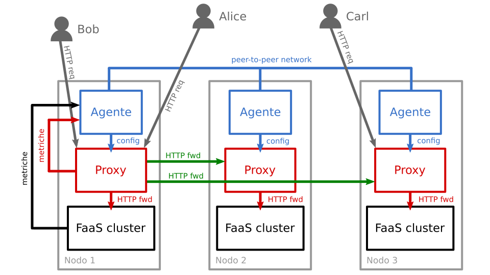
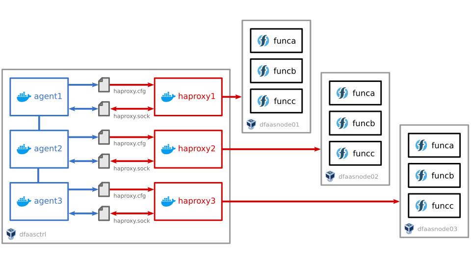

# DFaaS

**DFaaS**: *Decentralized FaaS*

**Struttura ideale del sistema**: ogni nodo è un server fisico a se stante.



**Struttura reale del prototipo implementato**: quattro macchine virtuali, di cui tre contengono i cluster faas e una contiene tutti i container degli agenti e dei proxy.



## Procedura per tirare su il sistema

### Preliminari pc host

- avere un pc con windows 10
- installare chocolatey (https://chocolatey.org/install)
- aprire una shell come amministratore e digitare il comando `choco install gsudo git virtualbox php` per installare i pacchetti necessari
- consigliato: aprire una finestra di Git Bash e digitare: `curl -o "$HOME/.minttyrc" https://raw.githubusercontent.com/dmotte/minttyrc/master/.minttyrc`
- installare WSL (Windows Subsystem for Linux). Consigliata la distro Debian
- aggiungere il contenuto del file `ssh-client-config/ssh-client-config.txt` di questo repo in coda al file `C:\Users\<nome>\.ssh\config`
- installare Ansible all'interno di WSL (https://docs.ansible.com/ansible/latest/installation_guide/intro_installation.html#installing-ansible-on-debian)

### Creazione macchine virtuali

- modificare la riga `DEBIAN_ISO_LOCAL_PATH` dei file `01-vbox-nodes/main.sh` e `02-vbox-dfaasctrl/main.sh` in modo tale che la directory in cui salvare la ISO di Debian esista realmente
- eseguire lo script `01-vbox-nodes/main.sh` all'interno di una finestra di terminale *Git Bash*
- eseguire lo script `02-vbox-dfaasctrl/main.sh` all'interno di una finestra di terminale *Git Bash*

### Installazione debian sulle vm dei cluster

- avviare il webserver `03-preseed-nodes/serve.sh` all'interno di una finestra di terminale *Git Bash*
- per ognuna delle 3 vm con nome `DFaaSNode*`:
  - avviare la vm
  - premere subito ESC al boot
  - digitare il boot command `auto url=http://192.168.0.105:8080/preseed-*.cfg` (sostituendo opportunamente l'asterisco in base alla vm, esempio `preseed-01.cfg`) (sostituendo `192.168.0.105` con l'indirizzo ip locale del proprio computer)
  - attendere il termine dell'installazione automatizzata di Debian sulla vm. Essa si spegnerà da sola al termine!
- stoppare il webserver

### Installazione debian sulla vm dfaasctrl

- avviare il webserver `04-preseed-dfaasctrl/serve.sh` all'interno di una finestra di terminale *Git Bash*
- avviare la vm `DFaaSCtrl`
- premere subito ESC al boot
- digitare il boot command `auto url=http://192.168.0.105:8080/preseed.cfg` (sostituendo `192.168.0.105` con l'indirizzo ip locale del proprio computer)
- attendere il termine dell'installazione automatizzata di Debian sulla vm. Essa si spegnerà da sola al termine!
- stoppare il webserver

### Installazione OpenFaaS sulle vm dei cluster

> Nota: per accedere alle VM i parametri SSH/SFTP sono i seguenti:
> - node01.dfaas.lvh.me:12201 username: `debian`, password: `debpass2020`
> - node02.dfaas.lvh.me:12202 username: `debian`, password: `debpass2020`
> - node03.dfaas.lvh.me:12203 username: `debian`, password: `debpass2020`
> - ctrl.dfaas.lvh.me:12200 username: `debian`, password: `debpass2020`

- avviare le tre vm `DFaaSNode*`
- per ognuna di esse, copiare lo script `05-bash-nodes/setup-packages.sh` nella directory home di Debian ed eseguirlo come root
  - suggerimento: per copiare il file sulle vm, è possibile utilizzare il client SFTP *WinSCP*
- lasciare pure aperte le tre vm. serviranno per dopo

### Deployment funzioni FaaS di esempio sulle vm dei cluster

- assicurarsi di avere TUTTE E QUATTRO le macchine virtuali aperte
- eseguire lo script `06-ansible-playbooks/reset-ssh-keys-wsl.sh` all'interno di Git Bash
- eseguire lo script `06-ansible-playbooks/script-setup-client.sh` all'interno di Git Bash
- eseguire lo script `06-ansible-playbooks/script-setup-functions.sh` all'interno di Git Bash (deve essere eseguito una sola volta)
- eseguire lo script `06-ansible-playbooks/script-deploy-functions.sh` all'interno di Git Bash (puo' essere rieseguito in futuro per ri-deployare le funzioni)

### Configurazione vm dfaasctrl

- eseguire lo script `06-ansible-playbooks/script-setup-server.sh` all'interno di Git Bash (deve essere eseguito una sola volta)
- eseguire lo script `06-ansible-playbooks/script-deploy.sh` all'interno di Git Bash (puo' essere rieseguito in futuro per ri-deployare le funzioni)

### Testing funzionamento

> Nota: per effettuare richieste a funzioni FaaS dall'host:
> - http://node01.dfaas.lvh.me:18001/function/funca
> - http://node02.dfaas.lvh.me:18002/function/funca
> - http://node03.dfaas.lvh.me:18003/function/funca

> Nota: per effettuare richieste a funzioni FaaS dall'interno della vm DFaaSCtrl:
> - http://127.0.0.1:8001/function/funca
> - http://127.0.0.1:8002/function/funca
> - http://127.0.0.1:8003/function/funca

Da una finestra Git Bash, digitare il comando `ssh dfaasctrl` per connettersi tramite SSH alla macchina virtuale DFaaSCtrl. Quindi, grazie a cURL, è possibile effettuare una richiesta ad una funzione FaaS contattando direttamente il container. Esempio:

```bash
curl http://192.168.15.50:8001/function/funca
```

Attenzione! &Egrave; necessario attendere qualche minuto (periodo di ricalcolo) prima che le funzioni possano essere effettivamente raggiungibili. Se si vuole cambiare la durata del periodo di ricalcolo, modificare la riga `--recalc-period` nel file `playbook-deploy.yml`.

Per un testing completo, è possibile utilizzare lo script `vegeta-testing-script/vegeta-testing-script.sh`. Tale script va copiato nella directory `/home/debian` della macchina virtuale DFaaSCtrl ed eseguito da lì. I risultati del test saranno salvati nella cartella `/home/debian/vegeta-results`.
