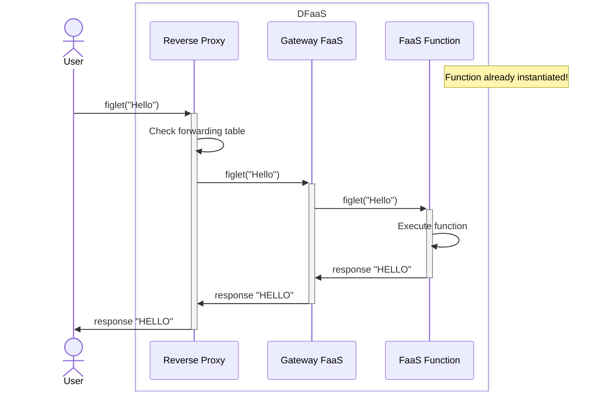
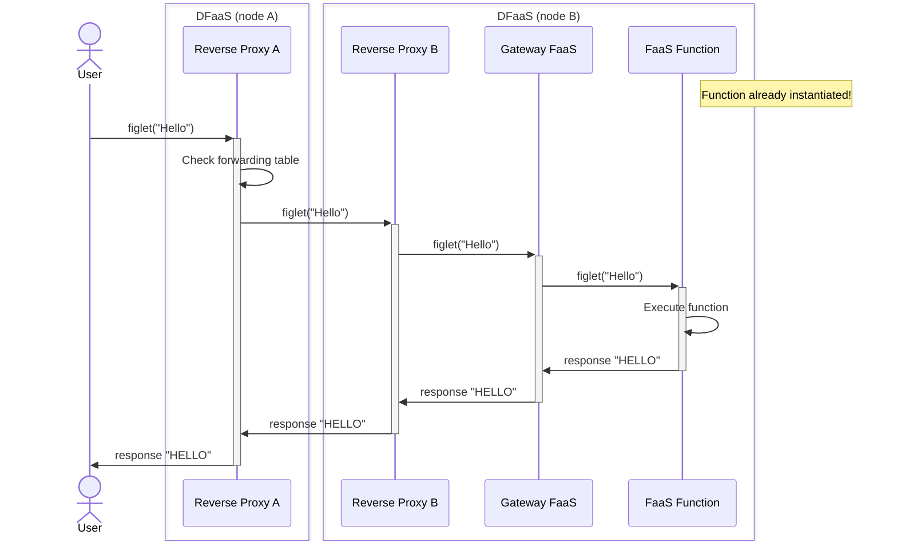
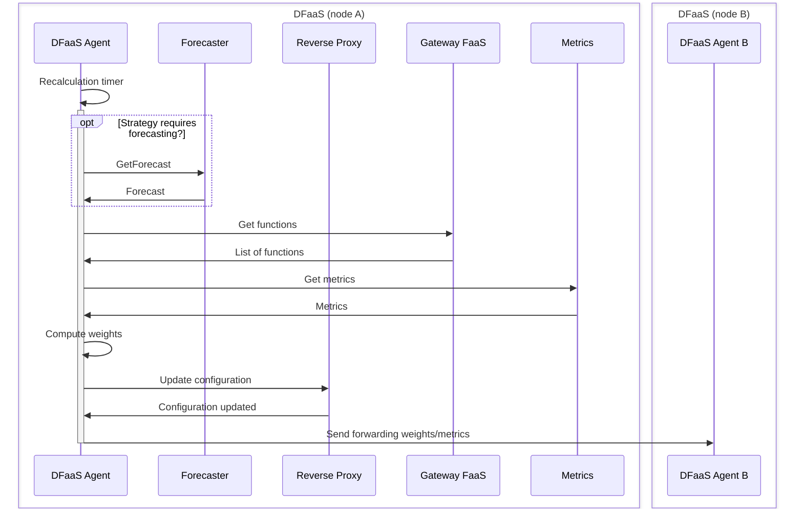

# DFaaS overview

## High-level components of a single DFaaS node

* DFaaS Agent
* Reverse proxy (HAProxy)
* FaaS platform (OpenFaaS)
* Metrics (Prometheus)

## Low-level components of a single DFaaS node

Single DFaaS node: a single Kubernetes (k3s) cluster composed of a single node.

| Component        | Deployment/Chart  | Pods | Containers |
|------------------|-------------------|------|------------|
| DFaaS Agent      | DFaaS Agent       | 1    | 1          |
| DFaaS Agent      | DFaaS Forecaster  | 1    | 1          |
| Proxy            | HAProxy           | 1    | 1          |
| FaaS Platform    | OpenFaaS          | 1    | 2          |
| Metrics          | Prometheus        | 4    | 5          |

Note: in addition there are the individual FaaS functions (with zero or more replicas).

### Proxy

* Reverse proxy used: HAProxy
* Proxy used directly in the Kubernetes cluster: no Ingress/Gateway objects.
* Main needs: connect DFaaS agents and perform request routing with weights (for forwarding/processing/rejection).

Improvement proposals:

* Stay with HAProxy: there is no reason to change, it works well.
* Avoid restarting HAProxy too frequently to reload the configuration: use the REST API to update weights/backends. Only restart if strictly necessary (e.g., adding a neighbor).

### FaaS Platform

* Platform used: OpenFaaS
* Main flow: User -> Proxy -> Gateway (OpenFaaS) -> Function (and vice versa for the response)
* Requests are synchronous: there is no intermediate queue. As a consequence, in case of cold start and overload, request losses can occur.
* Limitations of OpenFaaS Community Edition: max 5 replicas per function, no CRD for functions (must use the Gateway REST API), limited metrics

Improvement proposals:

* Replace OpenFaaS with OpenWhisk
* Migration advantages: request queueing (Kafka), fewer limitations tied to premium/pro features, additional metrics
* Disadvantages: still no CRD for functions (in OpenFaaS it's available in pro), introduction of a request queue (Kafka), migration effort required

### Metrics

* Platform used: Prometheus
* Collected metrics (every 5s): DFaaS agent, OpenFaaS (used by OpenFaaS for scaling decisions), cAdvisor (integrated in k3s), node exporter
* Metrics used by the agent^: node exporter, OpenFaaS and cAdvisor

^ depends on the offloading strategy

## Data flow

Without forwarding:

With forwarding:

## Control flow

Periodic weight recalculation:

## Offloading strategies implemented in DFaaS

The strategies determine the computation of request handling weights (forwarding, local processing, or rejection).

### Recalc Strategy

* Introduced in the thesis "Study and implementation of a peer-to-peer architecture for decentralized execution of FaaS functions" by Davide Motterlini
* Partially working: generally works but there are two small bugs to fix (see unimib-datAI/dfaas/issues/48 and unimib-datAI/dfaas/issues/45)
* Based on a static limit (`maxrate`) per function to determine over/underload state.

### Node Margin Strategy

* Introduced in the paper "Analysis and Evaluation of Load Management Strategies in a Decentralized FaaS Environment: A Simulation-Based Framework" by Filippini... (derived from two theses)
* Partially working: the issue is in the forecasting models which are not accurate
* Requires the forecasting component (`dfaas-forecaster`).

### Static Strategy

* Baseline with static weights: 60% probability of local processing, 40% probability of forwarding (if there is at least one neighbor) equally distributed.
* Working

## Running experiments

* Traffic generator: k6
* The experiment (node setup, traffic generation and reporting) is manual

## How DFaaS nodes are connected

* Physically: mesh network (?)
* Logically: p2p network, all DFaaS nodes are connected to each other
* Forwarding occurs to all nodes in the p2p network; there is no concept of proximity/latency
* DFaaS agents exchange periodic direct messages (control flow)

Improvement proposals:

* Add latency awareness
* Split the logical network into data and control:
    * Control network: remains p2p among all nodes
    * Data network: a node forwards only to nearby nodes (determined statically or dynamically via latency)
