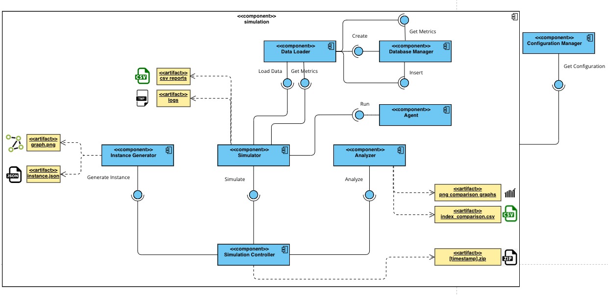
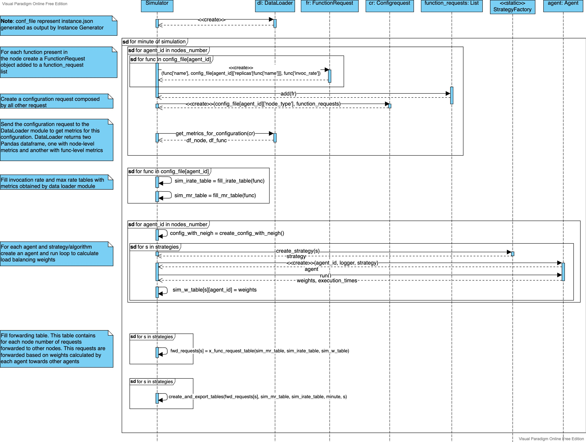
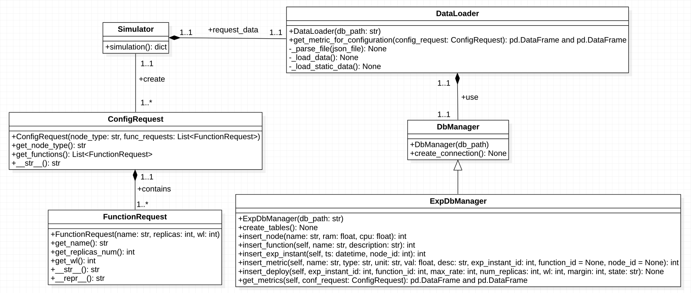
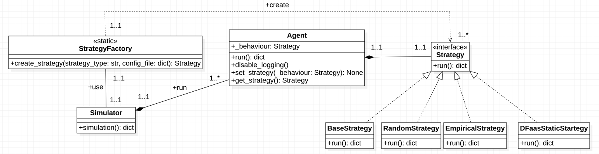
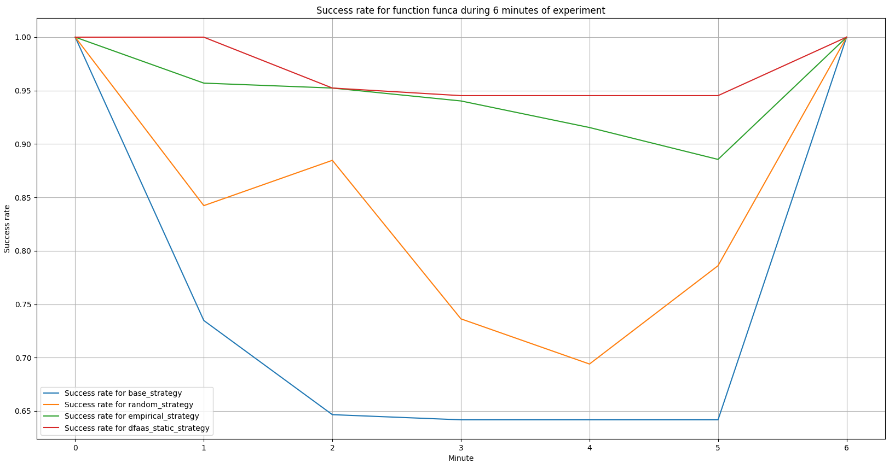
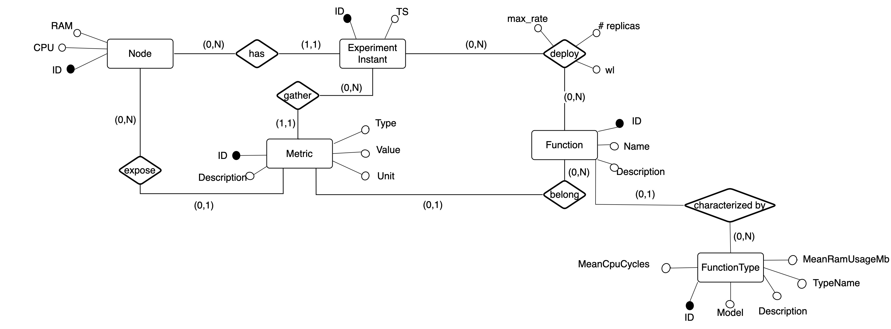

# Simulation module

The simulator has been realized with the aim of creating an environment where to implement and test varios load balancing strategies.

An high-level overview of the simulation modules and their output is reported in the following image. This picture represent the UML Component Diagram of the simulator. In blu are highlighted main modules, and in yellow their output artifacts.



The simulation takes place in **steps**, also called **simulation instants**; each of them corresponds to a different situation or configuration that must be simulated in terms of traffic to be balanced.

## Main components of simulation 

The simulation is coordinated by the entry point of the applicarion, the **simulation conrtoller**, the uses other three main modules: the **instance generator**, the **simulator** and the **analyzer**.

### Simulation controller

Acts as **entry point of the application**. It can receive as input a json file representing the instance to simulate (in this case skip the instance generation phase). His behaviour consist of 3 main phases:

1) **Instance generation**. Uses **instance generator** to generate json represenation of the instance to simulate. If an instance is passsed as CLI argument to **simulation controller** this phase is skipped. This phase is executed only one time. In this phase _instance\_generator.py_ is called.

Next phases are executed 5 times to simulate more times the same experiment and obtain more stable results.

2) **Simulation**. During this phase _simulation.py_ is executed, and the json instance generated in the previous phase is executed.

3) **Analyze**. Output files produced by the simulation phase, with forwarded requests to each agent towards nearby nodes are analyzed by this componente and specified **indexes** used for comparison are calculated (like success rate, reject number, etc.). In this phase _analyzer.py_ is executed.

At the end all five experiments are exported as a CSV file, with all indexes calculated for each load balancing strategy.

All artifacts produced by this process are gathered in a zip file as name the timestamp, under [**output**](outputs/) directory.

### Instance Generator

The script **instance_generator.py** can be also used independently by the **simulation controller**, and is used to generate the istance that needs to be simulated. This script take 3 CLI arguments:

- **Agente number**. Number of agents to simulate.
- **Seed**. Seed used as starting point for pseudo-random generation process.
- **Edge probability**. Probability to genarete an edge between each pair of agents. This is used to genrate a random network topology.

The artifact produced by this element are: generated json instance and an image of corresponding network topology. Both this elements can be found in **output/archive/[timestamp].zip** output directory.

### Simulator

This element is concened to execute all steps of simulation, calculating load balancing weights of each agent towards other agents of the network, using different techniques, and calculating forwarding tables. In this phase is executed _simulation.py_ script.

In the following picture a UML sequence diagram of simulator main operations is reported.



This component is the main part of the **simulation** package, and uses a various number of other components. In the following UML Class diagram the architecture of this main components.



Simulation uses **data loader** as service class to obtain data from the underlaying database. This component uses a **ExpDbManager** object to obtain data stored in experiments database. In this database are stored data gathered by experiments of DFaaS system, obtained to execute simulation based on real data.

The **simulator**, reading instance file, need to retrieve data aboout specific situation to simulate. This data are requested through **ConfigurationRequests**, composed of **FunctionRequests**, to **data loader**.

Each agent, during simulation, execute different load balancing strategies. How this classes are organized is represented in the following picture.



### Analyzer

This component analyze **simulator** output files and calculate indexes used for comparison between different strategies.

Main index calculated are:

1) **Success rate**. Percentage of requests managed with success by the system, applaying a specific load balancing technique.

2) **Success rate during stress period**. Percentage of requests managed with success by the system, applaying a specific load balancing technique, when the load is higher.

3) **reject number**. Number of rejected request by the system.

This script export a CSV file containing mean, variance, median, sum and 90% percentile of this index. It also export comparison simulation graph that compares success rates of different startegies during simulation (see figure below).



### Database Manager and Experiment database Manager

This component is used by the **simulator**, through the **data loader** to obtain data stored in the database. This module (under the folder _database_manager_) is composed by a super-class (**DbManager**) that manager connection to SQLlite database, and a sub-class (**ExpDbManager**) that manage data access and loading. **Data loader** component, uses the **ExpDbManager** interface to load, select and insert data. 

The database contains data gathered by the experiment, reported in [**data**](data/) folder.

The restructured ER diagram of the database is reported below.



## Configuration Manager

This utility class (_configuration/configuration\_manager.py_) contains all paramter, variables, strategy names, and settings of simulator. 

- **Note**: is an algorithm is added to simulator or some paramters need to change, they must be changed in this configuration class.

## Implemented Strategies

During simulation are executed all load balancing strategies defined in _behaviour_ module, and added in _configuration/configuration\_manager.py_ class.

The implemented strategies are:

- **Empirical Strategy**. This is the main distribuited load balancing algorithm. This strategy organize agent control loop following the MAPE-K feedback loop pattern. This algorithm based the weights calculation on **metrics** gathered by each agent. Those metrics synthesize the node and functions status. This strategy is implemented in _behaviour/empirical\_strategy.py_.

- **Random Startegy**. This startegy forward traffic randomly across nearby agents. This strategy is implemented in _behaviour/random\_strategy.py_.

- **Base Strategy**. This startegy does not forward traffic, each agent use only its resources. This strategy is implemented in _behaviour/base\_strategy.py_.

- **DFaaS Static Strategy**. This strategy is the previous one implemeneted in DFaaS system. that strategy base the weights calculation on limits of request calculated by each agent and exchanged with others (comunication is mocked in simulation). This strategy is implemented in _behaviour/dfaas\_static\_strategy.py_.

All of them strategies returns as output a set of weights for each overloaded function from each agent towards others (all available in **behaviour** moduole).

### How to add other strategies

To add a new strategy it is only necessary create a new file in _behaviour_ module, and the new class must implement the _behaviour/strategy.py_ "interface". New class must implement run method and return a dictionary containing forwarding weights.

It is also necessary add new strategy name in _configuration/configuration\_manager.py_ file and add method for strategy creation in _factory/strategy\_factory.py_ class.

## How to executed a simulation

For execute a simulation using **simulation controller** as entry point, first move on simulation folder from the project root.

```console
cd simulation
```

After that, type and execute the following command:

```console
python simulation_controller.py --nodesnum [integer number] --edgeprob [float probability between 0 and 1] --seed [integer number]
```
- **Note**: All parameters are optional.

Example: 

```console
python simulation_controller.py --nodesnum 10 --edgeprob 0.3 --seed 701 
```
- **Note**: It is also possible to pass a json instance file to **simulation controller**, to simulate a specific instance.

```console
python simulation_controller.py --instance "[filename].json" 
```

It is also possible to execute single scripts:

```console
python instance_generator.py --nodesnum 5 --edgeprob 0.3 --seed 711 
```

```console
python simulation.py
```

```console
python analyzer.py 
```